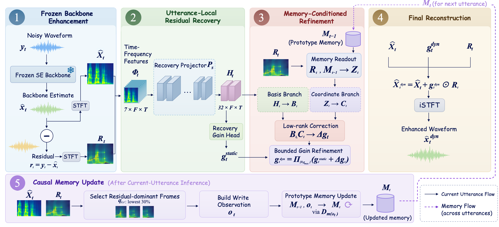

# Continual Residual Memory for Gradient-Free Test-Time Adaptation in Speech Enhancement

[](environment.yml)
[](LICENSE)

## Overview

Continual Residual Memory (CRM) is a gradient-free continual test-time adaptation method for speech enhancement. It selectively recovers the discarded residual of a frozen enhancement backbone: the current utterance provides utterance-local recovery, while causal prototype memory from preceding utterances refines that recovery. During deployment, the backbone and all learned CRM parameters remain frozen; only the memory state evolves. Please refer to the accompanying paper for methodological details.

<p align="center">
  
</p>
<p align="center"><em>Overview of Continual Residual Memory (CRM).</em></p>

## Installation

The recorded reproduction environment is NVIDIA/Linux with Python 3.9.25, PyTorch 2.8.0, CUDA 12.8, and cuDNN 9.10.02. From a clean environment:

```bash
git clone https://github.com/Ada312/continual-residual-memory.git
cd continual-residual-memory

conda create -n crm python=3.9.25 -y
conda activate crm
python -m pip install --upgrade pip
python -m pip install torch==2.8.0 torchaudio==2.8.0 \
  --index-url https://download.pytorch.org/whl/cu128
python -m pip install -r requirements-core.txt
```

Use `requirements-baselines.txt` only for LaDen/MPol. Cross-backbone dependencies are optional and documented separately in [`docs/CROSS_BACKBONE.md`](docs/CROSS_BACKBONE.md).

## Pretrained Checkpoints

The released CRM checkpoints are included; the third-party CMGAN checkpoint is downloaded separately from the pinned SETTA revision.

| Component | Path | SHA256 |
| --- | --- | --- |
| Frozen CMGAN backbone | `checkpoints/external/cmgan_ears.th` | `2649bc63511f6c59bf2340f6ab2305c9c3f5fbe1aa949434c176ede3ec65108f` |
| Utterance-local residual recovery | `checkpoints/crm/static_best.th` | `69c19970b7000b09d1b611b0dbc8786c24c9d9ca1c788cc077ff551225030523` |
| Memory-conditioned refinement | `checkpoints/crm/dynamic_best.th` | `17d876b7a69d83b93dd335d3bad7c35bd4fda641f8176edb64094b974592be21` |

```bash
mkdir -p checkpoints/external
curl -L \
  https://raw.githubusercontent.com/tobiaaa/SETTA/08ea624f37dccc798f6bbffaf1f8f8e292c16e4b/checkpoints/cmgan_ears.th \
  -o checkpoints/external/cmgan_ears.th
echo "2649bc63511f6c59bf2340f6ab2305c9c3f5fbe1aa949434c176ede3ec65108f  checkpoints/external/cmgan_ears.th" \
  | sha256sum -c -
```

The CMGAN file was published by the SETTA/LaDen-MPol implementation and was not trained by the CRM authors. Its provenance and redistribution decision are documented in [`checkpoints/README.md`](checkpoints/README.md) and [`docs/CHECKPOINTS.md`](docs/CHECKPOINTS.md).

## Data Preparation

Raw datasets are not redistributed. Obtain them from the official [EARS](https://github.com/facebookresearch/ears_dataset), [EARS benchmark](https://github.com/sp-uhh/ears_benchmark), [WHAM!](http://wham.whisper.ai/), [DNS Challenge](https://github.com/microsoft/DNS-Challenge), [DEMAND](https://doi.org/10.5281/zenodo.1227121), [LibriSpeech](https://www.openslr.org/12), and [MUSAN](https://www.openslr.org/17) sources and follow their licenses.

| Split | Role | Expected size | Frozen protocol |
| --- | --- | ---: | --- |
| EARS-WHAM train | CRM training only | 8,192 | `manifests/training/subset_manifest.json` |
| EARS-WHAM held-out | checkpoint selection only | 632 | `manifests/training/subset_manifest.json` |
| DNS 2020 synthetic no-reverb | target evaluation only | 150 | `manifests/dns.csv` |
| EARS-D | target evaluation only | 886 | `manifests/ears_d.csv` |
| Libri-MUSAN | target evaluation only | 2,620 | `manifests/musan_music.csv` |

Set a local data root and prepare the fixed EARS-WHAM training view from an official EARS-WHAM v1 build:

```bash
export DATA_ROOT=/path/to/crm-data
export EARS_WHAM_V1_ROOT=/path/to/EARS-WHAM

python data/prepare_ears_wham_from_benchmark.py \
  --ears-wham-root "$EARS_WHAM_V1_ROOT" \
  --out-dir "$DATA_ROOT/ears_wham"
```

Place the official DNS no-reverb files under `$DATA_ROOT/dns/{clean,noisy}` with filenames matching `manifests/dns.csv`. Reconstruct EARS-D and Libri-MUSAN as follows:

```bash
python data/prepare_ears_d.py \
  --ears-dir /path/to/EARS \
  --wham-dir /path/to/WHAM/audio \
  --test-files manifests/protocol/ears_benchmark_v1_test_files.json \
  --demand-index manifests/protocol/demand_16k_index.csv \
  --demand-dir /path/to/DEMAND/16k \
  --ears-w-out "$DATA_ROOT/ears_w_test" \
  --ears-d-out "$DATA_ROOT/ears_d"

python data/prepare_libri_musan.py \
  --manifest manifests/musan_music_construction.csv \
  --librispeech-root /path/to/LibriSpeech/test-clean \
  --musan-root /path/to/musan \
  --output-root "$DATA_ROOT/libri_musan" \
  --verify-hashes
```

Each target root must contain matching `clean/` and `noisy/` WAV files. Target clean speech is used only by offline evaluation and never by inference or memory update. See [`docs/DATA.md`](docs/DATA.md) for protocol details.

## Reproducing the Main Results

The two paths below are intentionally distinct. The included CRM checkpoints support direct inference/evaluation; from-scratch reproduction retrains Stage 1 and Stage 2 before evaluation.

### Stage 1: Utterance-Local Residual Recovery

First cache the frozen CMGAN estimates for EARS-WHAM, then train Stage 1 with the paper configuration:

```bash
python backbones/cmgan/inference.py \
  --noisy-dir "$DATA_ROOT/ears_wham/noisy" \
  --output-dir "$DATA_ROOT/ears_wham/source" \
  --checkpoint checkpoints/external/cmgan_ears.th

python scripts/train_recovery.py \
  --config configs/cmgan/recovery_training.json \
  --clean-dir "$DATA_ROOT/ears_wham/clean" \
  --noisy-dir "$DATA_ROOT/ears_wham/noisy" \
  --source-dir "$DATA_ROOT/ears_wham/source" \
  --output-dir outputs/train_recovery
```

This stage uses 16 kHz audio, a 512-point Hann STFT with 128-sample hop, 2-s crops, batch size 8, AdamW with weight decay `1e-4`, cosine scheduling, 4 epochs, and learning rate `3e-4`.

### Stage 2: Memory-Conditioned Refinement

```bash
python scripts/train_refinement.py \
  --config configs/cmgan/refinement_training.json \
  --clean-dir "$DATA_ROOT/ears_wham/clean" \
  --noisy-dir "$DATA_ROOT/ears_wham/noisy" \
  --source-dir "$DATA_ROOT/ears_wham/source" \
  --metadata "$DATA_ROOT/ears_wham/metadata.txt" \
  --recovery-checkpoint outputs/train_recovery/best.th \
  --context-cache outputs/cache/ears_wham_k2_grouped.pt \
  --output-dir outputs/train_refinement
```

If the context cache does not exist, the entry creates it from causal EARS-WHAM histories grouped by WHAM recording location. The fixed Stage 2 configuration uses 3 epochs, learning rate `1e-3`, `K_train=2`, memory dropout `0.20`, `tau_cf=0.02`, `lambda_cf=0.10`, and `lambda_cons=0.10`. Training uses `tau_mem=0.50` without posterior-mass truncation; deployment uses `K_max=64` and `gamma_read=0.95`. The remaining fixed values are `p=0.30`, `d=4`, `g_max=0.10`, and `alpha_dyn=0.08`.

### Inference

For the released-checkpoint path, run one independent empty-memory stream per target dataset:

```bash
python scripts/eval_main.py \
  --dataset dns \
  --noisy-dir "$DATA_ROOT/dns/noisy" \
  --clean-dir "$DATA_ROOT/dns/clean" \
  --cmgan-checkpoint checkpoints/external/cmgan_ears.th \
  --recovery-checkpoint checkpoints/crm/static_best.th \
  --refinement-checkpoint checkpoints/crm/dynamic_best.th \
  --output-dir outputs/main/dns
```

Repeat with `--dataset ears_d` and `--dataset libri_musan`, changing the data and output roots. For a from-scratch run, replace the two CRM checkpoint paths with `outputs/train_recovery/best.th` and `outputs/train_refinement/best.th`.

### Evaluation

`scripts/eval_main.py` automatically evaluates Frozen CMGAN, CRM without memory, and CRM with the shared seven-metric pipeline. To evaluate an existing CRM waveform directory directly:

```bash
python metrics/evaluate.py \
  --clean-dir "$DATA_ROOT/dns/clean" \
  --noisy-dir "$DATA_ROOT/dns/noisy" \
  --denoised-dir outputs/main/dns/crm/wav \
  --out-dir outputs/main/dns/crm/metrics \
  --method crm \
  --references manifests/dns.csv \
  --fs 16000
```

LaDen/MPol reproduction is optional and documented in [`docs/BASELINES.md`](docs/BASELINES.md). Additional cross-backbone experiments are documented separately in [`docs/CROSS_BACKBONE.md`](docs/CROSS_BACKBONE.md). The complete command reference is in [`docs/REPRODUCTION.md`](docs/REPRODUCTION.md).

## Expected Reproduction

PESQ sanity checks for the released checkpoints are:

| Dataset | Frozen CMGAN | CRM |
| --- | ---: | ---: |
| DNS | 3.00 | 3.11 |
| EARS-D | 2.62 | 2.64 |
| Libri-MUSAN | 2.16 | 2.27 |

These values are provided only as reproduction sanity checks. Please refer to the paper for the complete evaluation results. Small numerical differences may arise from stochastic training and environment differences.

## Repository Structure

```text
continual-residual-memory/
├── crm/          # CRM model, memory, and two-stage training implementation
├── backbones/    # CMGAN compatibility code and optional backbone adapters
├── configs/      # Frozen training and deployment configurations
├── data/         # Dataset preparation entries
├── scripts/      # Training, inference, evaluation, and aggregation entries
├── checkpoints/  # Released CRM weights and external-checkpoint instructions
├── manifests/    # Fixed identities, splits, and causal test order
├── metrics/      # Shared seven-metric evaluation pipeline
├── docs/         # Detailed reproduction and supplementary protocols
└── tests/        # Checkpoint, causal-order, and pipeline checks
```

## Acknowledgements

The main CMGAN checkpoint and the LaDen/MPol baseline implementation are provided by [SETTA](https://github.com/tobiaaa/SETTA). The frozen backbone is based on [CMGAN](https://github.com/ruizhecao96/CMGAN), and the EARS-WHAM preparation follows the [EARS benchmark](https://github.com/sp-uhh/ears_benchmark). We thank the authors for releasing their code, checkpoints, and data protocols.

## Citation

If you find this work useful, please cite:

```bibtex
@misc{shan2026continual,
  title  = {Continual Residual Memory for Gradient-Free Test-Time Adaptation in Speech Enhancement},
  author = {Shan, Yijia and Wang, Tianrui and Wang, Zixiang and Wang, Yu and Chen, Xie},
  year   = {2026}
}
```

## License

Project code is released under [GPL-3.0](LICENSE). Third-party components and protocol metadata remain subject to their respective terms; see [`THIRD_PARTY.md`](THIRD_PARTY.md) and [`THIRD_PARTY_NOTICES.md`](THIRD_PARTY_NOTICES.md).
